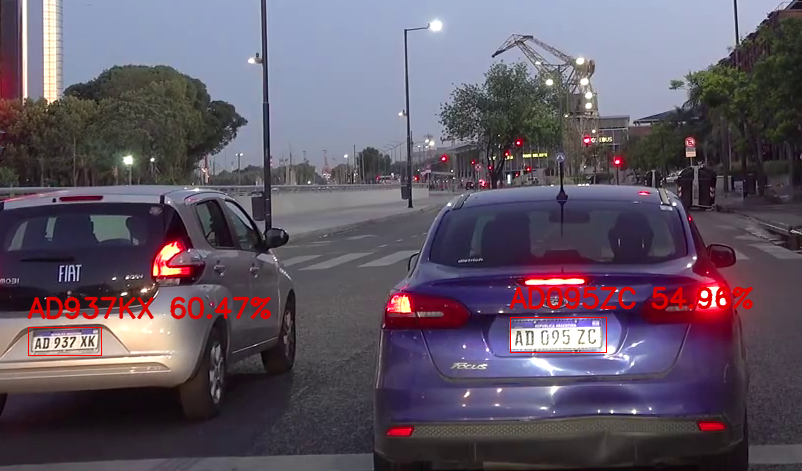

# Reconocedor de Texto(OCR) para Patentes vehiculares de Argentina



**OCR** implementado con solo Redes Convolucionales (**CNN**) de Patentes Argentinas. Los modelos son entrenados con patentes de 6 digitos (viejas) y patentes del Mercosur de 7 digitos (las nuevas). Este repo esta dedicado solamente al modulo que se encarga de *f(imagen patente recortada) = texto de patente*

Es común que se aplique una **ConvNet(CNN)** y una **Recurrent Neural Net. (LSTM/GRU)** para modelar este tipo de problema de secuencia de caracteres a partir de una imagen. En este caso se implementan solo ConvNets debido a:
* Se busca deployear en **sistemas embebidos** como RaspBerry Pi + Accelerator, por ende tiene que ser ligero.
* No tenemos el problema de una **secuencia variable de longitud**. El máximo de caracteres posibles es 7 (para Argentina) por ende las patentes de 6 digitos se le asigna una caracter extra para indicar el faltante.

## Uso

### Instalar dependencias

Contar con **python 3.x**, instalar los requerimientos:

```posh
pip install requirements.txt
```

## Visualizar predicciones

```posh
python demo_recog.py -m models/m1_93_vpa_2.0M-i2.h5 -i benchmark/imgs
```

*Se visualizaran las predicciones hechas a patentes que se encuentren en la carpeta val_set/imgs/*

## Calcular precisión

```posh
python valid.py -m models/m1_93_vpa_2.0M-i2.h5
```

Ejemplo de salida:

```posh
loss: 1.3214 - cat_acc: 0.9845 - plate_acc: 0.9388 - top_3_k: 0.9961
```

*La precisión se calcula en base a las imagenes de benchmark/*

## Entrenar

Para las imagenes y anotaciones se tiene que:
1. Mover las imagenes (sin procesar) de las patentes en `train_val_set/train/`
2. En el archivo `train_val_set/train_anotaciones.txt` escribir las anotaciones en formato (separado por tab)
```train_val_set/train/patente_img.png	ABC123DE```

*Recomendado: hacer lo mismo que lo de arriba para el set de validacion* 
1. Igual que el anterior pero copiar las imagenes en `train_val_set/valid/`
2. Parecido al anterior pero ahora en el archivo `train_val_set/valid_anotaciones.txt`, con formato (separado por tab)
```train_val_set/valid/patente_img.png	123ABC```

*No hay que convertir a blanco & negro las imagenes ni ajustar el tamaño. Tampoco hay que rellenar con '_' las patentes de 6 digitos, se hace todo automatico*

#### Opciones

```posh
usage: train.py [-h] [-vis] [-i ANOTACIONES_PATH] [-v VAL_ANOTACIONES_PATH]
                [-a HEIGHT] [-ancho WIDTH] [-l LR] [-b BATCH_SIZE]
                [-o OUTPUT_PATH] [-e EPOCHS] [-ca] [-ba] [-g]

optional arguments:
  -vis, --visualizar-aug
                        Visualizar Data Augmentation (no entrenar)
  -i ANOTACIONES_PATH, --anotaciones ANOTACIONES_PATH
                        Path del .txt que contiene las anotaciones
  -v VAL_ANOTACIONES_PATH, --val-anotaciones VAL_ANOTACIONES_PATH
                        Path del .txt que contiene las anotaciones
  -a HEIGHT, --altura HEIGHT
                        Alto de imagen a utilizar
  -ancho WIDTH, --ancho WIDTH
                        Ancho de imagen a utilizar
  -l LR, --learning-rate LR
                        Valor del learning rate
  -b BATCH_SIZE, --batch-size BATCH_SIZE
                        Tamaño del batch, predeterminado 64
  -o OUTPUT_PATH, --output-dir OUTPUT_PATH
                        Path para guarda el modelo
  -e EPOCHS, --epochs EPOCHS
                        Cantidad de Epochs(cuantas veces se ve el dataset
                        completo
  -ca, --cut-out        Aplicar cut out a las imagenes, adicionalmente al
                        Augmentation normal
  -ba, --blur           Aplicar blur a las imagenes, adicionalmente al
                        Augmentation normal
  -g, --graficos        Guardar imagenes graficos de entrenamiento (loss,
                        cat_acc, etc...)
```

#### Ejemplo

Para entrenar con 
* Por 500 epochs (aunque hay por default [EarlyStopping](https://www.tensorflow.org/api_docs/python/tf/keras/callbacks/EarlyStopping))
* Learning rate inicial de 0.001 con [Adam](https://www.tensorflow.org/api_docs/python/tf/keras/optimizers/Adam)
* Mini-batch de 64 (Disminuirlo si la GPU se queda sin memoria)
* Alto y Ancho de 70 x 140 (experimenten con otros)
* Graficos de entrenamiento (loss y de las 3 metricas personalizada)
* CutOut

```posh
python train.py --epochs 500 --learning-rate 0.001 --batch-size 64 --altura 70 --ancho 140 --graficos --cut-out
```

Los graficos/estadisticas se guardan en la carpeta principal, y el modelo tambien con el nombre `model2m_trained.h5`. Para cambiar el lugar de destino del modelo a guarda usar `--output-dir`

### Visualizar Data Augmentation

Para visualizar el tipo de Augmentation que va a recibir el modelo se ejecuta:

```posh
python train.py --visualizar-aug
```

De esta forma se puede ajustar/mejorar la augmentation que se encuentra en `train.py`

## Caracteristicas

Los modelos son las tipicas ConvNet, y estan formadas por bloques de **Convolution -> BatchNorm -> Activation -> MaxPooling** ... hasta formar un volumen de AxHx1024 *(altura x ancho x canales)* ... se le aplica **GlobalAvgPooling** para formar un volumen de 1x1x1024 que se conecta (mediante una Fully Conected Layer) con 37 x 7 unidades con activacion `softmax`. El numero 37 viene de 26 (vocabulario) + 10 digitos + simbolo de faltante `'_'`, por 7 porque por cada posición tiene una probabilidad de 37 caracteres. Los **bloques usados** para la ConvNet se encuentran en [layer_blocks.py](layer_blocks.py)


* **Regularización**: Se probo [DropBlock](https://arxiv.org/abs/1810.12890), DropOut y l2 reg. a los filtros. Este ultimo junto a [CutOut](https://arxiv.org/abs/1708.04552) dieron los mejores resultados
   * **Label Smoothing**: le da un 10% notorio de aumento de `plate_acc`. Se suavizan los one-hot encoding y pasan de ser (por ejemplo) ```[0, 0, 0, 1]``` a ```[0.01, 0.01, 0.01, 0.90]```
* **Data Augmentation**: Se usa la augmentacion estandard de Keras y se aplica:
    * Cambios de brillo
    * Leve rotaciones
    * Shearing (tambien leve)
    * Zoom
    * Desplazamiento Vertical/Horizontal
* **Input**
   * Imagen **blanco & negro**
       * 70x140 *(altura x ancho)*
       * Interpolacion **bilineal**

## Validación

Para validar la calidad de los modelos se utilizara *principalmente* una metrica personalizada `plate_acc`. Esta simplemente calcula el porcentaje de patentes bien categorizadas **en su totalidad**.

Ejemplo si se tiene 2 patentes: { `AB 123 DC`, `GKO 697` } y se predice { `AB 123 CC`, `GKO 697` } la precisión es de 50%, una patente correctamente reconocida y la otra no.
Métrica definida en Keras:
```python
from tensorflow.keras import backend as K

def plate_acc(y_true, y_pred):
    et = K.equal(K.argmax(y_true), K.argmax(y_pred))
    return K.mean(
        K.cast(
          K.all(et, axis=-1, keepdims=False),
          dtype='float32'
        )
    )
```

Ninguna imagen (como corresponde) del benchmark fue usada para entrenar el modelo. Para evaluar mejor la precisión se necesita un validation-set **publico** con mas imagenes, ya que el que se encuentre en el repo son solo 150~ imagenes.


## Set - Validación

La fuente del set de validación proviene de [video night drive](https://www.youtube.com/watch?v=75X9vSFCh14) y [video morning drive](https://www.youtube.com/watch?v=-TPJot7-HTs). Créditos a [J Utah](https://www.youtube.com/channel/UCBcVQr-07MH-p9e2kRTdB3A).

Formato de *benchmark/anotaciones.txt* (separado por tab):
```
imgs/nombre_imagen.png  ABC 123 DE
```

*Si desean colaborar para expandir el set de validación, mejor para validar la precisión de los modelos.*

## Active Learning

Hacer las anotaciones de miles de patentes resulta un trabajo **largo** e **impractico**. Por eso se propone, **"Active Learning"** que simplemente con el modelo base entrenado (con 1800~ imagenes) se predicen patentes no vistas. Luego anotan solo las patentes de **baja confianza**. Este es un proceso **iterativo** y se repite hasta llegar a la precisión deseada (en el test de validación)


Para decidir si la prediccion tiene poca confianza, se utiliza:

* Si por lo menos un caracter esta poco seguro
```python
def on_any(probs, thresh=.3):
  return any([True if prob < thresh else False for prob in probs])
```

* Si el promedio de todos los caracteres esta por debajo de un valor
```python
def on_avg(probs, avg_thresh=.2):
  return statistics.mean(probs) < avg_thresh 
```

*Métodos no optimizados, solo para ilustración*

En la siguiente tabla se va a mostrar los modelos (misma arquitectura) pero con más imagenes de entrenamiento, basado en el criterio anterior. Para eliminar la varianza en los resultados, y ver el impacto de agregar mas imagenes al dataset de entrenamiento: la arquitectura, método de optimizacion, Data Augmentation ... no cambia en absoluto.

#### Modelo 1 (2 M params)

| iteracion  | Set-Entrenamiento | cat_acc | plate_acc | top_3_k |
| -------  | ---------- | ----------- | ------ | ------ |
| 1 |  1853  |  0.9495 |  0.8435  |  0.9757  |
| 2 |   2873   |  **0.9786**  |	 **0.8912**  |  **0.9922**  |
| 3 |   -   | - | - | - |

#### Modelo 2 (1.5 M params)

| iteracion  | Set-Entrenamiento | cat_acc | plate_acc | top_3_k |
| -------  | ---------- | ----------- | ------ | ------ |
| 1 |  1853  |  0.9602 |	0.8639 |	0.9806 |
| 2 |   2873   |  **0.9845** |	**0.9388** |	**0.9961**
| 3 |   -   | - | - | - |


* **top_3_k** calcula que tan seguido el caracter verdadero se encuentra en las 3 predicciones con mayor probabilidades
* **cat_acc** es simplemente la [CategoricalAccuracy](https://www.tensorflow.org/api_docs/python/tf/keras/metrics/CategoricalAccuracy) para problemas de multi-class labels. **Ejemplo** si el label correcto es `ABC123` y se predice `ABC133` no va a dar una precisión de 0% como plate_acc *(no clasificada correctamente en su totalidad)*, sino de 83.3% (5/6)

*Estas metricas estan ubicadas en el archivo custom.py*

## Data Augmentation


Configuracion de Data Aug en Keras:

```python
datagen = ImageDataGenerator(
    rescale=1/255.,
    rotation_range=10,
    width_shift_range=0.05,
    height_shift_range=0.10,
    brightness_range=(0.5, 1.5),
    shear_range=8,
    zoom_range=0.12
)
```

Ademas como metodos extras de Data Augmentation se incluyo Blur y CutOut, se puede encontrar definido en `extra_augmentation.py`.

*Aclaracion: A proposito se busco, manualmente, que de vez en cuando los caracteres salgan **un poco** del frame. Esto ayuda a que generalice mejor y que no se espere una patente recortada perfectamente.

## TODO

- [x] Publicar modelos
- [x] Label Smoothing
- [x] Active Learning
- [x] Ampliar val-set
- [x] Aumentar el training-set de patentes de motos
- [x] Disminuir # de parametros
- [x] Aplicar blur a las imagenes(Data Augmentation)
- [x] Aplicar CutOut a las imagenes(Data Augmentation)
- [ ] Quantizar el modelo a INT8
- [ ] Realizar prunning al modelo
- [ ] Compilarlo para Edge TPU
- [ ] Probar AutoKeras
- [ ] Hacer version universal (Patentes de EU, BR, ...)

### Notas

* Este modelo esta hecho especialmente para patentes vehiculares **no** *Argentinas*
* Para obtener la mejor precisión es recomendable utilizar obtener las patentes recortadas con [YOLO v4/v4 tiny](https://github.com/ankandrew/LocalizadorPatentes)
* La Cantidad de vehiculos y motos esta en desproporcion, las fotos de motos representan menos del 40% del training-set *(Por ahora)*
* DropBlock & SAM(Spatial Attention Module) no dieron buenos resultados. *Puede ser porque el Modelo muy chico*
* Para hacer Quantization Aware Training (y no Post-Training Quant.) se requiere cambiar la estructura del modelo y no usar tf.keras.layers.Concatenate (porque no esta soportado todavia)
* CutOut si bien es Data Augmentation (Pone cuadrados negros random en la imagen de entrada) tiene efecto de regulación. Por ende no hace falta usar l2 reg, se puede usar directamente el `block_bn_no_l2` encontrado en `layer_blocks.py`
